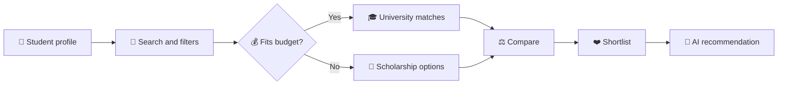

<div align="center">

# 🇵🇰 Pak University Advisor

### Find a Pakistani university that fits your future, location, degree, and budget.

<p>
  <a href="https://pak-university-advisor.vercel.app"></a>
  <a href="https://github.com/AbdulAzeemHashmi/pak-university-advisor"></a>
  
  
</p>


<p><strong>Open source project for students navigating higher education in Pakistan.</strong></p>

</div>

<br>

## 🧭 The Problem

Students choosing a university often have to piece together tuition fees, locations, programs, sector information, and financial aid from scattered sources. This is especially difficult when a limited budget closes the obvious options and scholarship information is hard to find.

**Pak University Advisor** brings these decisions into one bilingual experience. It helps students discover realistic choices, understand the tradeoffs, and find a practical next step instead of guessing.

> **Important:** University details and scholarship availability can change. Use this project as a discovery and planning tool, then confirm fees, admissions, deadlines, and eligibility with the institution or scholarship provider.

## ✨ What You Can Do

| Experience | What it provides |
| --- | --- |
| 🎓 **University discovery** | Search a curated dataset by name, city, province, category, sector, degree, and distance education. |
| 💰 **Budget aware filtering** | Find institutions whose maximum annual fee fits a student defined PKR budget. |
| 🪄 **Scholarship fallback** | When no direct fee match exists, surface universities linked to HEC or USAID scholarship pathways. |
| 🤖 **AI advisor** | Generate grounded recommendations from the local dataset through OpenRouter, with a bilingual response. |
| ⚖️ **Comparison** | Compare selected institutions across fees, programs, rankings, location, sector, and aid. |
| ❤️ **Shortlists** | Save promising universities and review them in a focused shortlist view. |
| 🌐 **English and Urdu** | Switch between English and Urdu, including right to left Urdu layouts. |
| 🔐 **Accounts** | Sign up, log in with credentials, manage a profile, and use password reset flows. |

## 🖼️ Product Flow



## 🧱 Technology Stack

| Area | Tools |
| --- | --- |
| **Application** | Next.js 15 App Router, React 19, TypeScript 5 |
| **Styling** | Tailwind CSS 4, PostCSS, Pakistani green and gold visual system, glass UI surfaces |
| **Components** | Radix UI primitives, shadcn/ui patterns, Lucide React icons |
| **Routing and language** | next-intl, locale routes for `en` and `ur`, RTL support |
| **Data** | Processed CSV and JSON datasets, local data access layer, Xata client integration |
| **Authentication** | Auth.js v5 with credentials authentication and Xata adapter support |
| **AI** | OpenRouter API using a free Gemini model when `OPENROUTER_API_KEY` is configured |
| **Email** | Resend API for password reset messages |
| **Deployment** | Vercel compatible Next.js application |
| **Developer tools** | ESLint, TypeScript, Python data preparation scripts |

## 🚀 Quick Start

### Requirements

- Node.js 20 or newer
- npm
- Python 3.8 or newer for dataset preparation scripts

### Install and run

```bash
git clone https://github.com/AbdulAzeemHashmi/pak-university-advisor.git
cd pak-university-advisor
npm install
python scripts/merge_datasets.py
npm run dev
```

Open [http://localhost:3000](http://localhost:3000). Locale routes are available at `/en` and `/ur`.

### Available commands

| Command | Purpose |
| --- | --- |
| `npm run dev` | Start the local development server |
| `npm run build` | Create a production build |
| `npm run start` | Serve the production build |
| `npm run lint` | Run the configured lint command |
| `python scripts/merge_datasets.py` | Merge source university datasets into processed data |

## 🔐 Configuration

Create a local `.env.local` file when you need external services. The app has local fallbacks for data and some development flows, so the basic interface can still be explored without every key.

```env
AUTH_SECRET=replace-with-a-long-random-secret
OPENROUTER_API_KEY=your-openrouter-key
RESEND_API_KEY=your-resend-key
NEXT_PUBLIC_APP_URL=http://localhost:3000
XATA_DATABASE_URL=your-xata-database-url
XATA_API_KEY=your-xata-api-key
XATA_BRANCH=main
```

### Configuration notes

- `OPENROUTER_API_KEY` enables the external AI recommendation request. Without it, the API returns a bilingual heuristic recommendation grounded in local matches.
- `RESEND_API_KEY` enables email delivery for password resets. Without it, development requests return a temporary `devCode`.
- Password reset OTPs are stored in memory and are intended for development behavior, not production persistence.
- The current university read layer uses the processed local dataset. Review the Xata setup before treating remote persistence as enabled in production.
- Never commit `.env.local` or expose server only keys in client code.

## 📂 Repository Map

```text
pak-university-advisor/
├── data/
│   ├── processed/                  # Merged master CSV and JSON data
│   └── scholarship_lists/          # HEC and USAID scholarship source lists
├── public/                         # Fonts and static images
├── scripts/
│   ├── merge_datasets.py           # Build the processed university dataset
│   ├── scrape_hec_scholarships.py  # Collect HEC scholarship data
│   ├── scrape_usaid_scholarships.py# Collect USAID scholarship data
│   └── seed_xata.py                 # Seed remote Xata data
├── src/
│   ├── app/
│   │   ├── [locale]/               # Localized English and Urdu pages
│   │   │   ├── auth/               # Login, signup, and password reset
│   │   │   ├── compare/            # Side by side comparison
│   │   │   ├── profile/            # User profile
│   │   │   ├── shortlist/          # Saved universities
│   │   │   ├── universities/       # Search and filtering
│   │   │   └── page.tsx            # Home experience
│   │   ├── api/                   # AI, auth, scholarship, shortlist, and university APIs
│   │   ├── globals.css             # Global theme, RTL, glass UI, and animations
│   │   └── layout.tsx              # Root application layout
│   ├── components/                 # Feature components and reusable UI primitives
│   ├── hooks/                      # Shared React hooks
│   ├── i18n/                       # Routing and translation configuration
│   ├── lib/                        # Data, Auth.js, Xata, and utility modules
│   ├── messages/                   # `en.json` and `ur.json` translation files
│   └── types/                      # Shared TypeScript models
├── universities.csv                # Source university data
├── Dataset_of_Universities_in_Pakistan.csv
├── Top_20_Pakistani_Universities.csv
├── components.json                 # UI component configuration
├── next.config.ts                  # Next.js configuration
└── package.json                    # Scripts and dependencies
```

## 🔌 API Surface

| Endpoint | Method | Responsibility |
| --- | --- | --- |
| `/api/universities` | `GET` | Search, filter, and paginate universities |
| `/api/scholarships` | `GET` | Return scholarship linked institutions |
| `/api/ai-recommend` | `POST` | Generate a personalized bilingual recommendation |
| `/api/shortlist` | `GET`, `POST`, `DELETE` | Read and update a user shortlist |
| `/api/auth/[...nextauth]` | Auth.js | Session and credential authentication |
| `/api/auth/forgot-password` | `POST`, `GET` | Request and verify reset OTPs |
| `/api/auth/reset-password` | `POST` | Complete a password reset |

## 🧪 Data Workflow

1. Place or update source CSV files in the repository root or `data/` folders.
2. Run `python scripts/merge_datasets.py` to normalize and merge university records.
3. Review `data/processed/master_universities.csv` and `data/processed/master_universities.json`.
4. Run the application and verify search, budget fallback, scholarship, and comparison behavior.
5. Confirm critical facts with official university and scholarship sources before publishing updates.

## 🤝 Contributing

1. Fork the repository and create a focused branch.
2. Make a small, documented change that matches the existing TypeScript and UI patterns.
3. Run `npm run build` and the relevant data checks before opening a pull request.
4. Explain the user problem, implementation, and verification steps in the pull request.

Useful contribution areas include data freshness, scholarship verification, Urdu translations, accessibility, test coverage, and production persistence.

## 📜 License

Distributed under the MIT License. Read [LICENSE](LICENSE) for details.

<div align="center">

### Made for clearer university decisions in Pakistan 🇵🇰


</div>
