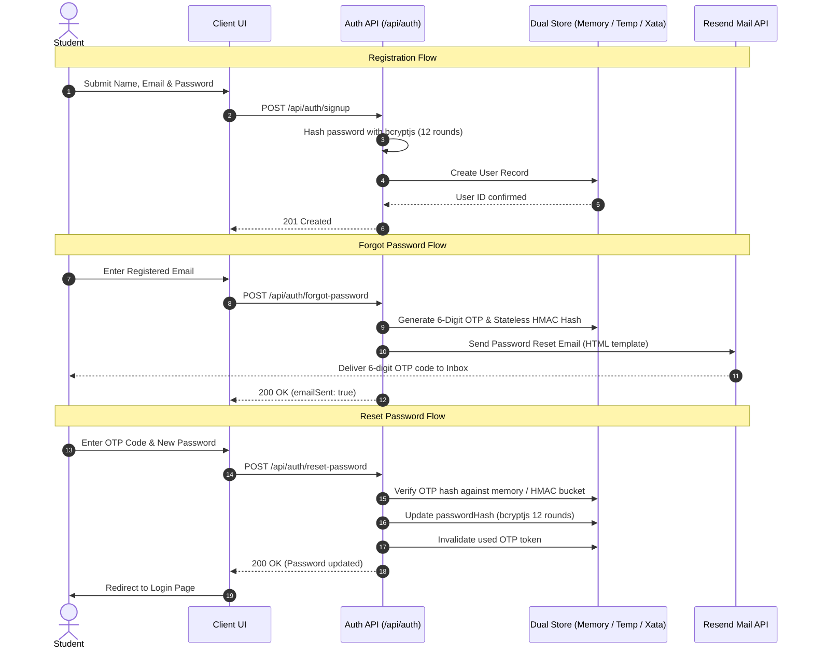

# Pak University Advisor

<div align="center">


<h3>Bilingual AI-Powered Higher Education & Scholarship Guidance Platform</h3>

<p>
  <strong>Empowering students across Pakistan to discover, compare, and navigate 260+ recognized higher education institutions with real-time RAG AI guidance.</strong>
</p>

[](https://pak-university-advisor.vercel.app/)
[](https://nextjs.org/)
[](https://react.dev/)
[](https://www.typescriptlang.org/)
[](https://tailwindcss.com/)
[](https://authjs.dev/)
[](LICENSE)

<br />

<p align="center">
  <a href="https://pak-university-advisor.vercel.app/">View Live Application</a>
  •
  <a href="https://github.com/AbdulAzeemHashmi/pak-university-advisor">GitHub Repository</a>
  •
  <a href="#quick-start">Quick Start</a>
  •
  <a href="#api-reference">API Docs</a>
</p>

</div>

---

## Table of Contents

- [Overview](#overview)
- [System Architecture](#system-architecture)
- [Key Features](#key-features)
- [Dataset & Data Engineering](#dataset--data-engineering)
  - [Web Scraping Pipeline](#web-scraping-pipeline)
  - [Data Cleansing & Normalization](#data-cleansing--normalization)
  - [Offline TF-IDF Vector Embedding Generation](#offline-tf-idf-vector-embedding-generation)
- [Frontend Architecture & UI/UX](#frontend-architecture--uiux)
  - [Design System & Aesthetics](#design-system--aesthetics)
  - [Bilingual Support & RTL Handling](#bilingual-support--rtl-handling)
  - [Client Components & Pages](#client-components--pages)
- [Backend Services & API Architecture](#backend-services--api-architecture)
  - [RAG AI Search Engine](#rag-ai-search-engine)
  - [Structured Recommendation Engine](#structured-recommendation-engine)
  - [Security & Rate Limiting](#security--rate-limiting)
- [Authentication, Security & Mail Delivery](#authentication-security--mail-delivery)
  - [User Registration & Login Flow](#user-registration--login-flow)
  - [Forgot Password & Verification Flow](#forgot-password--verification-flow)
  - [Reset Password Execution](#reset-password-execution)
  - [Transactional Mail Service](#transactional-mail-service)
- [Database Architecture & Persistence](#database-architecture--persistence)
- [API Reference](#api-reference)
- [Environment Configuration](#environment-configuration)
- [Quick Start & Local Development](#quick-start--local-development)
- [Project Directory Structure](#project-directory-structure)
- [License](#license)

---

## Overview

Pak University Advisor is an end-to-end higher education portal designed specifically for Pakistani students, parents, and academic counselors. Finding up-to-date information regarding tuition fees, HEC recognition, provincial quotas, and financial aid in Pakistan is traditionally fragmented.

This platform centralizes data for **260+ recognized public and private universities** across Islamabad Capital Territory, Punjab, Sindh, Khyber Pakhtunkhwa, Balochistan, Azad Jammu and Kashmir, and Gilgit-Baltistan. The platform pairs verified institutional records with an offline sub-30ms vector search index and Google Gemini LLM integration via OpenRouter, delivering grounded career counseling in both English and Urdu.

---

## System Architecture

The following diagram illustrates the application flow across client interfaces, localization middleware, serverless API routes, vector retrieval, external AI services, database layers, and transactional mail services:

```mermaid
flowchart TD
    subgraph CLIENT_LAYER["Client Layer (Next.js 15 / React 19)"]
        UI_EN["English Portal (/en)"]
        UI_UR["Urdu RTL Portal (/ur)"]
        MODAL_RAG["RAG AI Counselor Drawer"]
        MODAL_REC["Structured Advisor Form"]
        MODAL_COMP["4-Way Comparison Matrix"]
        MODAL_AUTH["Auth, Reset & Profile"]
    end

    subgraph MIDDLEWARE_LAYER["Routing & Middleware"]
        MW["next-intl Localization Middleware"]
        GUARD["AuthGuard Session Validator"]
    end

    subgraph BACKEND_LAYER["Next.js Serverless Route Handlers (/api)"]
        API_RAG["/api/rag-chat (Hybrid Vector Search)"]
        API_REC["/api/ai-recommend (Rule-based + LLM)"]
        API_UNI["/api/universities (Search & Filters)"]
        API_SCH["/api/scholarships (HEC/USAID List)"]
        API_SL["/api/shortlist (Save & Sync)"]
        API_AUTH["/api/auth/* (Credentials, Forgot, Reset)"]
    end

    subgraph VECTOR_ENGINE["Offline RAG Vector Engine"]
        VEC_JSON[("university_embeddings.json (TF-IDF N-Grams)")]
        COS_CALC["Cosine Similarity & Intent Booster"]
    end

    subgraph EXTERNAL_SERVICES["External Services"]
        OPENROUTER["OpenRouter API (Gemini 2.0 Flash Lite)"]
        RESEND["Resend API (Transactional OTP Emails)"]
        XATA_DB[("Xata Serverless Database")]
    end

    subgraph LOCAL_STORE["Dual Persistence Layer"]
        MEM_STORE["In-Memory Global Cache"]
        TMP_FS["Writable Temp Filesystem (/tmp)"]
    end

    UI_EN --> MW
    UI_UR --> MW
    MW --> GUARD

    MODAL_RAG --> API_RAG
    MODAL_REC --> API_REC
    UI_EN --> API_UNI
    UI_UR --> API_UNI
    MODAL_COMP --> API_UNI
    MODAL_AUTH --> API_AUTH
    MODAL_AUTH --> API_SL

    API_RAG --> COS_CALC
    COS_CALC --> VEC_JSON
    API_RAG --> OPENROUTER

    API_REC --> API_UNI
    API_REC --> OPENROUTER

    API_AUTH --> RESEND
    API_AUTH --> MEM_STORE
    API_AUTH --> TMP_FS
    API_AUTH --> XATA_DB
    API_SL --> MEM_STORE
    API_SL --> TMP_FS
```



---

## Key Features

| Capability | Technical Implementation | Description |
|---|---|---|
| **RAG AI Admissions Counselor** | Cosine Similarity vector store + OpenRouter Gemini LLM | Answers student inquiries with factual data grounded in 260+ university profiles and HEC/USAID scholarship criteria. |
| **Budget-Aware University Search** | Dynamic multi-predicate query evaluator | Filters institutions by maximum annual tuition budget (PKR), discipline, city, province, and charter status. |
| **Smart Scholarship Fallback** | Fallback recommendation heuristic | Automatically surfaces 100% tuition-waiver alternatives (HEC Need-Based / USAID MNBSP) when private fees exceed user budget. |
| **Multi-University Comparison** | Dynamic side-by-side matrix view | Compares up to 4 institutions simultaneously across fee schedules, rankings, contact info, and degree programs. |
| **Shortlisting & Bookmarking** | NextAuth JWT session sync with persistence | Allows students to save preferred institutions to a private profile with instant synchronization. |
| **Complete Urdu Localization** | `next-intl` with native Right-to-Left (RTL) styling | Full Urdu UI with localized typography, bidirectional layout switching, and Urdu text embeddings. |
| **Secure Authentication** | Auth.js v5, bcryptjs 12-round salt, JWT cookies | Student registration, encrypted password storage, and protected client/server routes. |
| **OTP Password Recovery** | 6-digit numeric token with stateless HMAC fallback | Delivers password reset codes via Resend transactional emails with dual memory and time-window validation. |

---

## Dataset & Data Engineering

The project contains a curated dataset representing Pakistan's higher education landscape. Data preparation is handled via automated scripts located in `scripts/`.

### Web Scraping Pipeline

1. **HEC Need-Based Scholarship Scraper (`scripts/scrape_hec_scholarships.py`)**:
   - Scrapes the official Higher Education Commission portal (`hec.gov.pk`) for accredited institutions participating in the Need-Based Scholarship scheme.
   - Handles custom user-agent headers, SSL verification bypass for government portals, and HTML entity cleanup.
   - Exports verified institutions to `data/scholarship_lists/hec_scholarship_universities.csv`.

2. **USAID Merit & Needs-Based Scholarship Scraper (`scripts/scrape_usaid_scholarships.py`)**:
   - Scrapes participating partner universities under the USAID MNBSP initiative.
   - Extracts focal officer details, regional coverage, and institutional contacts.
   - Exports verified institutions to `data/scholarship_lists/usaid_scholarship_universities.csv`.

### Data Cleansing & Normalization

The pipeline in `scripts/merge_datasets.py` consolidates multiple raw CSV datasets into a single master index:

- **Entity Deduplication**: Standardizes university names using regex normalization (`re.sub(r'[^a-z0-9]', '', name)`).
- **Urdu Transliteration Mapping**: Maps English university titles to official Urdu names (for example, *National University of Sciences and Technology* to *نسٹ یونیورسٹی، اسلام آباد*).
- **Contact & Web Parsing**: Validates domains, extracts institutional emails, and standardizes Pakistani telephone formatting (`+92-XX-XXXXXXX`).
- **Fee Tier Modeling**: Ingests baseline annual tuition structures, assigning realistic Pakistani Rupee (PKR) fee ranges across medical, engineering, business, and general disciplines.
- **Output Artifacts**:
  - `data/processed/master_universities.json` (Structured JSON record list)
  - `data/processed/master_universities.csv` (23-column master table)

### Offline TF-IDF Vector Embedding Generation

To achieve sub-30ms retrieval inside serverless function invocations without external vector database hosting costs, `scripts/generate_embeddings.js` compiles a custom lightweight vector store:

```javascript
// Tokenization pipeline supporting Latin characters and Urdu Unicode ranges
function tokenize(text) {
  const cleaned = text
    .toLowerCase()
    .replace(/[^\w\s\u0600-\u06FF]/g, ' ')
    .replace(/\s+/g, ' ')
    .trim();
  
  const words = cleaned.split(' ').filter(w => w.length > 1);
  const grams = [];
  
  // Unigram and Bigram extraction
  for (let i = 0; i < words.length; i++) {
    grams.push(words[i]);
    if (i < words.length - 1) {
      grams.push(`${words[i]}_${words[i + 1]}`);
    }
  }
  return grams;
}
```

- **Inverse Document Frequency (IDF)**: Calculated across 260+ documents (`IDF(term) = ln(1 + N / DF(term))`).
- **Vector Normalization**: Stores L2 norms per document for rapid Cosine Similarity dot-product computation during runtime queries.
- **Output Index**: Saved to `data/processed/university_embeddings.json`.

---

## Frontend Architecture & UI/UX

The frontend is built using Next.js 15 (App Router), React 19, and Tailwind CSS 4.

### Design System & Aesthetics

The visual identity is designed with modern glassmorphism and curated HSL color tokens inspired by national themes:

- **Primary Shade**: Pakistani Dark Green (`hsl(150, 97%, 13%)` / `#01411C`)
- **Secondary Shade**: Islamic Vibrant Green (`hsl(137, 69%, 33%)` / `#1A8F3C`)
- **Accent Shade**: Warm Gold (`hsl(37, 91%, 55%)` / `#F5A623`)
- **Background**: Soft Clean Slate (`#f8f9fa`) with dark mode support (`hsl(160, 40%, 5%)`)
- **Glassmorphism Components**: Backdrop blur filters (`backdrop-filter: blur(12px)`), subtle borders, and smooth hover micro-animations (`animate-fade-in`).

### Bilingual Support & RTL Handling

- **Localization Framework**: Configured via `next-intl` with routes nested under `src/app/[locale]/`.
- **Bidirectional Typography**: Automatic font switching between system sans-serif for Latin scripts and `Noto Sans Arabic` with RTL directional flow (`dir="rtl"`) for Urdu locales.
- **Dynamic Aliases**: Supports search queries in both English and Urdu (for example, searching *قائد اعظم یونیورسٹی* or *QAU* returns Quaid-i-Azam University).

### Client Components & Pages

- `src/components/UniversitiesSearchClient.tsx`: Interactive university search directory with instant debounced filtering.
- `src/components/FilterBar.tsx`: Dynamic filter controls for Province, City, Discipline, Sector (Public/Private), Distance Learning, and Fee Range.
- `src/components/UniversityCard.tsx`: Card component displaying sector badges, tuition fees, HEC/USAID scholarship tags, and quick-action buttons.
- `src/components/UniversityDetailModal.tsx`: Comprehensive modal presenting campus locations, chartered authorities, contact emails, and direct phone links.
- `src/components/CompareClientContent.tsx`: 4-column side-by-side comparison matrix.
- `src/components/ShortlistClientContent.tsx`: Bookmarked university board synced with the authenticated user account.
- `src/components/AIAdvisorModal.tsx`: Structured multi-step academic questionnaire generating personalized recommendations.
- `src/components/RAGChatWidget.tsx`: Floating conversational AI drawer with real-time vector citations.

---

## Backend Services & API Architecture

The backend operates entirely on Next.js serverless API routes (`src/app/api/`), ensuring instant scaling and zero idle compute costs.

### RAG AI Search Engine (`/api/rag-chat`)

1. **Query Tokenization**: Incoming user messages are normalized and broken down into unigrams and bigrams.
2. **Hybrid Vector Matching**:
   - Evaluates Cosine Similarity against `university_embeddings.json`.
   - Applies institutional acronym boosting (for example, mapping *NUST*, *FAST*, *LUMS*, *GIKI*, *UET*, *COMSATS*, *PIEAS*, *IBA* to canonical entity IDs).
   - Injects intent bonuses for queries containing terms such as *scholarship*, *cheap*, *low fee*, *public sector*, or *سرکاری*.
3. **Context Construction**: Formats the top 5 matched institutions into an authoritative factual brief.
4. **LLM Synthesis**: Dispatches prompt to OpenRouter (`google/gemini-2.0-flash-lite-001:free`) with instructions to produce a bilingual (English & Urdu) response.

### Structured Recommendation Engine (`/api/ai-recommend`)

Accepts student constraints including annual budget, desired discipline, preferred city, and academic percentage. If the stated budget cannot accommodate target private institutions, the engine automatically extracts matching regional public institutions and eligible scholarship programs.

### Security & Rate Limiting

- **In-Memory IP Limiting**: Restricts API calls (max 15 requests/hour per IP on RAG chat and 10 requests/hour on AI recommendations) to protect upstream inference quotas.
- **Input Validation**: Strict type, length, and range checks on all JSON payloads before execution.

---

## Authentication, Security & Mail Delivery

The authentication layer is implemented via Auth.js v5 (`next-auth`) combined with bcryptjs password hashing.



### User Registration & Login Flow

- **Endpoint**: `POST /api/auth/signup`
- **Validation**: Ensures unique email addresses, valid string lengths, and trims formatting.
- **Hashing**: Passwords are encrypted using `bcryptjs.hash(password, 12)`.
- **Session Handling**: Uses JSON Web Tokens (JWT) stored in HTTP-only, secure cookies.

### Forgot Password & Verification Flow

- **Endpoint**: `POST /api/auth/forgot-password`
- **OTP Generation**: Generates a secure 6-digit numeric OTP with a 15-minute expiration window.
- **Stateless HMAC Resilience**: In addition to memory storage, tokens are hashed using HMAC-SHA256 based on 15-minute time buckets (`Math.floor(Date.now() / (15 * 60 * 1000))`). This ensures OTP codes remain fully verifiable even if serverless instances restart or re-deploy.
- **Verification Endpoint**: `GET /api/auth/forgot-password?email=...&code=...` allows real-time pre-validation before final password submission.

### Reset Password Execution

- **Endpoint**: `POST /api/auth/reset-password`
- **Validation**: Enforces an 8-character minimum password policy, checks OTP authenticity, updates the password hash, and removes the active token from the store.

### Transactional Mail Service

Emails are dispatched through the **Resend API**:

- **From Address**: Configurable via `RESEND_FROM_EMAIL` (default: `Pak University Advisor <onboarding@resend.dev>`).
- **Template Design**: Inline CSS styled HTML email featuring brand colors, clear OTP highlight badge, expiry notice, and direct password reset action button.
- **Development Fallback**: In local development environments (`NODE_ENV !== "production"`), generated OTPs are logged directly to the server terminal.

---

## Database Architecture & Persistence

The platform utilizes a multi-tier persistence design to deliver high availability on both Vercel serverless functions and local environments:

```
+-------------------------------------------------------------------+
|                        Application Layer                          |
+-------------------------------------------------------------------+
                                  |
                                  v
+-------------------------------------------------------------------+
|                     Dual Persistence Interface                    |
|                        (src/lib/local-store.ts)                   |
+-------------------------------------------------------------------+
        |                         |                         |
        v                         v                         v
+---------------+         +---------------+         +---------------+
| Global Memory |         |  Writable FS  |         |     Xata      |
|  Cache Store  |         |   (/tmp dir)  |         |  PostgreSQL   |
+---------------+         +---------------+         +---------------+
```

### Storage Entities

1. **User Table (`users`)**:
   - `id` (UUID string)
   - `name` (string)
   - `email` (unique, lowercase string)
   - `passwordHash` (bcryptjs string)
   - `createdAt` (ISO timestamp)

2. **Shortlist Store (`shortlists`)**:
   - Map of `userId` to array of `universityId` strings (`Record<string, string[]>`).

3. **Reset Token Store (`resetTokens`)**:
   - `email` (string)
   - `codeHash` (bcryptjs string)
   - `expiresAt` (Unix timestamp)

4. **University Catalog (`universities`)**:
   - Static high-speed JSON record store parsed from `master_universities.json`.

---

## API Reference

| Route | Method | Payload / Parameters | Description |
|---|---|---|---|
| `/api/universities` | `GET` | `?searchQuery=&city=&province=&type=&category=&degree=&maxFee=&page=&limit=` | Returns paginated university records matching multi-predicate search criteria. |
| `/api/scholarships` | `GET` | `?city=&degree=` | Returns all universities offering HEC Need-Based or USAID scholarships. |
| `/api/rag-chat` | `POST` | `{ message: string, history?: Array, filters?: Object }` | Executes hybrid TF-IDF Cosine vector retrieval and generates a bilingual AI counselor response. |
| `/api/ai-recommend` | `POST` | `{ budget: number, location: string, degree: string, academicMarks: string }` | Generates a structured bilingual admission and financial aid action plan. |
| `/api/shortlist` | `GET` | None (requires authenticated JWT session) | Retrieves the authenticated student's saved university shortlist. |
| `/api/shortlist` | `POST` | `{ universityId: string }` | Adds a university to the student's personal shortlist. |
| `/api/shortlist` | `DELETE` | `{ universityId: string }` | Removes a university from the student's personal shortlist. |
| `/api/auth/signup` | `POST` | `{ name: string, email: string, password: string }` | Registers a new student account. |
| `/api/auth/forgot-password` | `POST` | `{ email: string }` | Generates a 6-digit OTP code and dispatches a reset email via Resend. |
| `/api/auth/forgot-password` | `GET` | `?email=string&code=string` | Validates OTP code validity prior to password update submission. |
| `/api/auth/reset-password` | `POST` | `{ email: string, code: string, password: string }` | Updates student account password upon verifying OTP token. |

---

## Environment Configuration

Create a `.env.local` file in the project root with the following keys:

```env
# NextAuth / Auth.js Configuration
AUTH_SECRET=your-random-32-character-secret-key
NEXTAUTH_URL=http://localhost:3000

# OpenRouter AI API (Gemini LLM Inference)
OPENROUTER_API_KEY=sk-or-v1-your-openrouter-key

# Resend Transactional Email API (Password Reset)
RESEND_API_KEY=re_your_resend_api_key
RESEND_FROM_EMAIL=Pak University Advisor <onboarding@resend.dev>

# Xata Database (Optional for Cloud Persistence)
XATA_BRANCH=main
XATA_API_KEY=your_xata_api_key
XATA_DATABASE_URL=https://your-workspace.xata.sh/db/pak-university-advisor
```

---

## Quick Start & Local Development

### 1. Prerequisites

- Node.js version 18.18 or higher
- npm, pnpm, or yarn
- Python 3.9 or higher (only required if re-running web scrapers)

### 2. Clone the Repository

```bash
git clone https://github.com/AbdulAzeemHashmi/pak-university-advisor.git
cd pak-university-advisor
```

### 3. Install Dependencies

```bash
npm install
```

### 4. Build Vector Embeddings

Generate the TF-IDF vector index before starting the development server:

```bash
npm run generate-embeddings
```

### 5. Start Development Server

```bash
npm run dev
```

Open your browser and navigate to:
- English Portal: [http://localhost:3000/en](http://localhost:3000/en)
- Urdu Portal: [http://localhost:3000/ur](http://localhost:3000/ur)

### 6. Production Build & Linting

```bash
npm run lint
npm run build
npm run start
```

---

## Project Directory Structure

```
pak-university-advisor/
├── data/
│   ├── processed/
│   │   ├── master_universities.csv          # Normalized 23-column master dataset
│   │   ├── master_universities.json         # Master university JSON objects
│   │   └── university_embeddings.json       # Pre-computed TF-IDF vector store
│   └── scholarship_lists/
│       ├── hec_scholarship_universities.csv # HEC partner institution list
│       └── usaid_scholarship_universities.csv # USAID partner institution list
├── public/
│   └── favicon.ico                          # Application icon
├── scripts/
│   ├── generate_embeddings.js               # TF-IDF vector index compiler
│   ├── merge_datasets.py                    # Cleansing and dataset unification script
│   ├── scrape_hec_scholarships.py           # HEC scholarship web scraper
│   ├── scrape_usaid_scholarships.py         # USAID MNBSP web scraper
│   └── seed_xata.py                         # Xata database seeding utility
├── src/
│   ├── app/
│   │   ├── [locale]/
│   │   │   ├── auth/
│   │   │   │   ├── forgot-password/page.tsx # Forgot password OTP request page
│   │   │   │   ├── login/page.tsx           # Student login page
│   │   │   │   ├── reset-password/page.tsx  # Password reset confirmation page
│   │   │   │   └── signup/page.tsx          # New account registration page
│   │   │   ├── compare/page.tsx             # 4-way comparison matrix page
│   │   │   ├── profile/page.tsx             # User profile page
│   │   │   ├── shortlist/page.tsx           # Saved universities shortlist page
│   │   │   ├── layout.tsx                   # Localized root layout (RTL/LTR)
│   │   │   └── page.tsx                     # Main directory and search page
│   │   ├── api/
│   │   │   ├── ai-recommend/route.ts        # Structured recommendation route
│   │   │   ├── auth/                        # NextAuth, signup, forgot, reset routes
│   │   │   ├── rag-chat/route.ts            # RAG hybrid search route
│   │   │   ├── scholarships/route.ts        # Scholarship listing route
│   │   │   ├── shortlist/route.ts           # Shortlist persistence route
│   │   │   └── universities/route.ts        # Search & filtering route
│   │   └── globals.css                      # Tailwind CSS 4 design tokens
│   ├── components/
│   │   ├── AIAdvisorModal.tsx               # Questionnaire counseling modal
│   │   ├── AuthGuard.tsx                    # Client-side route protection
│   │   ├── CompareClientContent.tsx         # University comparison table
│   │   ├── FilterBar.tsx                    # Multi-parameter filter panel
│   │   ├── HomeClientContent.tsx            # Main directory view container
│   │   ├── LanguageSwitcher.tsx             # English / Urdu locale toggle
│   │   ├── RAGChatWidget.tsx                # Floating RAG AI counselor drawer
│   │   ├── UniversityCard.tsx               # University summary card
│   │   └── UniversityDetailModal.tsx        # Comprehensive detail view
│   ├── lib/
│   │   ├── auth.ts                          # NextAuth configuration
│   │   ├── db.ts                            # Data filtering and query layer
│   │   ├── local-store.ts                   # Dual-tier user & token store
│   │   ├── rag-retrieval.ts                 # Hybrid vector retrieval engine
│   │   └── xata.ts                          # Xata database client
│   └── messages/
│       ├── en.json                          # English translations
│       └── ur.json                          # Urdu translations
├── middleware.ts                            # Next-intl routing middleware
├── next.config.ts                           # Next.js configuration
├── package.json                             # Dependencies and scripts
├── tailwind.config.ts                       # Tailwind styling configuration
└── tsconfig.json                            # TypeScript configuration
```

---

## License

This project is licensed under the MIT License. See the [LICENSE](LICENSE) file for complete terms.
