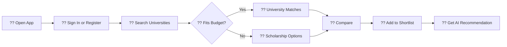

<div align="center">


<br/>

<p>
  <a href="https://pak-university-advisor.vercel.app"></a>
  <a href="https://github.com/AbdulAzeemHashmi/pak-university-advisor"></a>
  
  
  
</p>


<br/>

> **Open source platform helping Pakistani students discover universities, compare options, and unlock scholarship pathways.**

</div>

---

## ?? What Problem Does This Solve?

Choosing a university in Pakistan means digging through dozens of websites for fees, locations, programs, and scholarship eligibility. For students with limited budgets, this process is overwhelming and often results in missed opportunities.

**Pak University Advisor** centralizes all of this into a single bilingual experience. Students discover realistic options, understand their tradeoffs, and find a practical next step rather than guessing in the dark.

> **Important:** University fees and scholarship availability change frequently. Use this platform as a discovery and planning tool, then confirm details directly with institutions and scholarship providers.

---

## ? Features at a Glance

| Feature | What It Does |
|---|---|
| ?? **University Discovery** | Search 250+ recognized institutions by name, city, province, sector, degree, and distance learning |
| ?? **Budget Aware Filtering** | Filter universities whose annual fees fit within your PKR budget |
| ?? **Scholarship Fallback** | When no direct match exists, surface HEC and USAID scholarship pathway institutions |
| ?? **AI Advisor** | Get personalized bilingual recommendations powered by OpenRouter |
| ?? **Side by Side Comparison** | Compare universities on fees, programs, rankings, location, and aid |
| ?? **Shortlists** | Save promising universities to a personal shortlist |
| ?? **English and Urdu** | Full bilingual support with right-to-left Urdu layouts |
| ?? **Accounts** | Register, sign in, manage your profile, and reset your password |
| ?? **Smart Search** | Recognizes acronyms like FAST, NUCES, NUST, LUMS, UET, COMSATS, GIKI, IBA, GCU, and more |

---

## ??? User Journey



---

## ??? Technology Stack

| Layer | Technologies |
|---|---|
| ??? **Framework** | Next.js 15 App Router, React 19, TypeScript 5 |
| ?? **Styling** | Tailwind CSS 4, PostCSS, Pakistani green and gold design system |
| ?? **Components** | Radix UI, shadcn/ui patterns, Lucide React icons |
| ?? **Routing and i18n** | next-intl, locale routes for `en` and `ur`, full RTL support |
| ?? **Data** | Processed CSV and JSON university datasets, local data access layer |
| ?? **Auth** | Auth.js v5, JWT sessions, stateless HMAC OTP password reset |
| ?? **AI** | OpenRouter API (free Gemini model) with bilingual local fallback |
| ?? **Email** | Resend API for password reset delivery, on-screen OTP fallback |
| ?? **Deployment** | Vercel with `/tmp` storage adapter for serverless filesystem compatibility |
| ?? **Dev Tools** | ESLint, TypeScript strict mode, Python data preparation scripts |

---

## ?? Quick Start

### Requirements

- Node.js 20 or newer
- npm
- Python 3.8 or newer (for dataset preparation)

### Install and Run

```bash
git clone https://github.com/AbdulAzeemHashmi/pak-university-advisor.git
cd pak-university-advisor
npm install
python scripts/merge_datasets.py
npm run dev
```

Open [http://localhost:3000](http://localhost:3000). Locale routes are at `/en` and `/ur`.

### Available Commands

| Command | Purpose |
|---|---|
| `npm run dev` | Start the local development server |
| `npm run build` | Create a production build |
| `npm run start` | Serve the production build |
| `npm run lint` | Run the configured linter |
| `python scripts/merge_datasets.py` | Merge source university CSV datasets |

---

## ?? Configuration

Create a `.env.local` file for external services. The app has local fallbacks for most features, so you can explore the interface without every key configured.

```env
AUTH_SECRET=replace-with-a-long-random-secret
OPENROUTER_API_KEY=your-openrouter-key
RESEND_API_KEY=your-resend-key
NEXT_PUBLIC_APP_URL=http://localhost:3000
```

### Configuration Notes

- `OPENROUTER_API_KEY` enables real AI recommendations. Without it, a bilingual heuristic response from local data is returned.
- `RESEND_API_KEY` enables email delivery for password resets. Without it, a 6-digit code is displayed on-screen so users can still reset their password.
- `AUTH_SECRET` is used for JWT signing and stateless OTP verification. Use a long, random string in production.
- Never commit `.env.local` or expose server-only keys in client code.

---

## ?? API Reference

| Endpoint | Method | Responsibility |
|---|---|---|
| `/api/universities` | `GET` | Search, filter, and paginate universities |
| `/api/scholarships` | `GET` | Return scholarship linked institutions |
| `/api/ai-recommend` | `POST` | Generate a personalized bilingual recommendation |
| `/api/shortlist` | `GET`, `POST`, `DELETE` | Read and update a user shortlist |
| `/api/auth/[...nextauth]` | Auth.js | Session and credential authentication |
| `/api/auth/forgot-password` | `POST`, `GET` | Request and verify reset OTPs |
| `/api/auth/reset-password` | `POST` | Complete a password reset |

---

## ?? Project Structure

```text
pak-university-advisor/
+-- data/
¦   +-- processed/                  # Merged master CSV and JSON data
¦   +-- scholarship_lists/          # HEC and USAID scholarship source lists
+-- scripts/
¦   +-- merge_datasets.py           # Build the processed university dataset
¦   +-- scrape_hec_scholarships.py  # Collect HEC scholarship data
¦   +-- scrape_usaid_scholarships.py
+-- src/
¦   +-- app/
¦   ¦   +-- [locale]/               # Localized English and Urdu pages
¦   ¦   ¦   +-- auth/               # Login, signup, and password reset flows
¦   ¦   ¦   +-- compare/            # Side-by-side comparison page
¦   ¦   ¦   +-- profile/            # User profile and sign-out
¦   ¦   ¦   +-- shortlist/          # Saved universities
¦   ¦   ¦   +-- universities/       # Search and filtering
¦   ¦   ¦   +-- page.tsx            # Home page
¦   ¦   +-- api/                    # AI, auth, shortlist, and university APIs
¦   ¦   +-- globals.css             # Global theme, RTL, glass UI, and animations
¦   ¦   +-- layout.tsx              # Root application layout
¦   +-- components/                 # Feature components and UI primitives
¦   +-- hooks/                      # Shared React hooks
¦   +-- i18n/                       # Routing and translation configuration
¦   +-- lib/                        # Data layer, Auth.js, and utility modules
¦   +-- messages/                   # en.json and ur.json translation files
¦   +-- types/                      # Shared TypeScript models
+-- next.config.ts
+-- package.json
```

---

## ?? Data Workflow

```text
1. Place or update source CSVs in the repository root or data/ folder
2. Run: python scripts/merge_datasets.py
3. Review: data/processed/master_universities.json
4. Start the app and verify search, budget filtering, and scholarship behavior
5. Confirm fees and scholarship eligibility with official institutional sources
```

---

## ?? Contributing

1. ?? Fork the repository and create a focused branch
2. ?? Make a small, documented change matching existing TypeScript and UI patterns
3. ?? Run `npm run build` and verify data checks before opening a pull request
4. ?? Explain the user problem, implementation approach, and verification steps in the PR

Useful contribution areas include data freshness, scholarship verification, Urdu translations, accessibility improvements, and test coverage.

---

## ?? License

Distributed under the MIT License. See [LICENSE](LICENSE) for details.

---

<div align="center">

### ???? Built for students navigating higher education in Pakistan


<br/>


</div>
